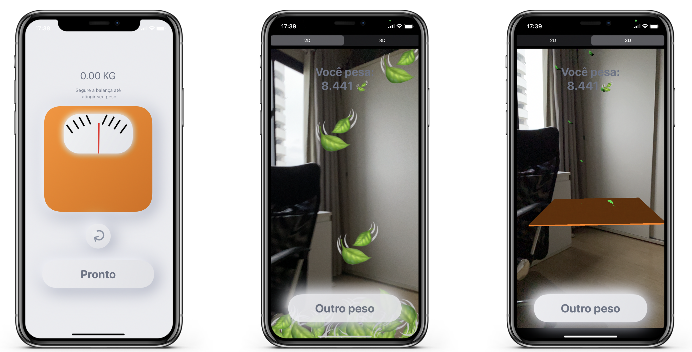

# LeafW8 

An application that compares humans and leafs weights, showing on the screen the number of leafs needed to reach the inputed weight. 

The App was built to experiment augmented reality using ARKit and SceneKit. Also, used Sketch to build a prototype.

## Demo

